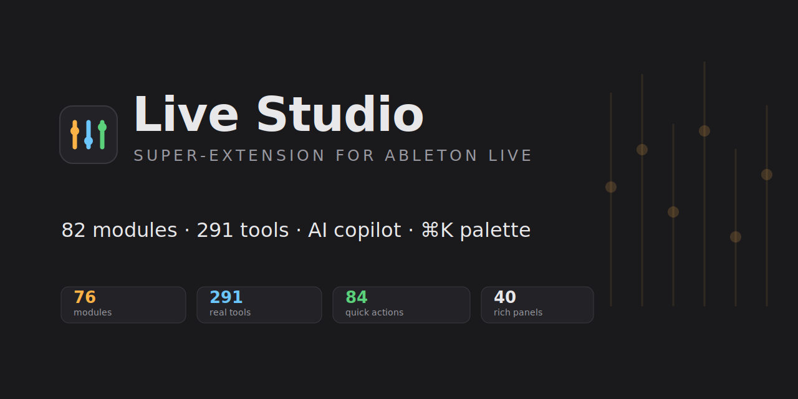

<p align="center">
  
</p>

<h1 align="center">🎛️ Live Studio</h1>

<p align="center">
  <b>Una super-extensión modular para Ableton Live.</b><br/>
  58 módulos · 249 tools · 1293 micro-acciones · copiloto IA · paleta <code>⌘K</code> — en un único webview por pestañas.
</p>

<p align="center">
  <a href="https://github.com/ramonsesma/live-studio/actions/workflows/ci.yml"></a>
  
  
  
  
  
  
  
  <a href="README.md"></a>
</p>

---

## ¿Qué es?

**Live Studio** reúne decenas de extensiones de producción musical para Ableton Live en **una sola
extensión**. En lugar de instalar y cargar muchas extensiones —cada una con su propio servidor
peleando por el mismo puerto— Live Studio las **ensambla** bajo:

- **un único servidor local + un único webview** con barra lateral por pestañas,
- **carga perezosa** de cada panel (arranca ligero aunque tenga decenas de módulos),
- un **copiloto IA** que controla cualquier módulo por lenguaje natural,
- y una **paleta de comandos rápidos** (`⌘K` / `Ctrl+K`) que busca y ejecuta sobre todo.

Nació de auditar **921 extensiones** propias (≈74.700 LOC) y consolidar lo mejor de cada concepto.

## ✨ Características

- **59 módulos** (58 visibles + 1 oculto) con **249 tools reales** repartidos por categorías:
  generación musical, drums, mezcla/mastering, EQ/análisis, síntesis, sampling, arreglo,
  performance/live, MIDI, hardware/control, gestión de proyectos, conversión audio↔MIDI y más.
- **Copiloto IA** (OpenRouter / OpenAI / OpenCode Zen) con loop de *tool-calling*: recibe las
  definiciones de los 249 tools y orquesta los módulos por lenguaje natural.
- **Paleta de comandos rápidos** (`⌘K`): indexa los **249 tools** + **1293 micro-acciones**
  (extraídas de 215 micro-extensiones) y las ejecuta con teclado.
- **11 paneles ricos** curados donde el formulario automático se queda corto: piano-roll,
  grafo de clips, matriz de modulación, mixer con faders/VU, rejillas de pasos y pads,
  mapa de drums, comping…
- **UI auto-generada** para el resto: cualquier módulo nuevo aparece con su formulario sin escribir
  HTML, leyendo las definiciones de sus tools.
- **Ligero**: bundle de ~468 KB, sin frameworks de frontend.
- **Probado**: 76 pruebas de humo end-to-end del servidor + módulos.

## 📸 Vistas

> La UI se ejecuta dentro de Ableton Live (vía `ctx.ui.showModalDialog`). Algunas vistas:
>
> - **Módulos** — barra lateral + panel con formularios auto-generados por tool.
> - **Copiloto IA** — chat que encadena `session__create_midi_track` → `chords__generate_chords` → `drums__generate_pattern` en una sola instrucción.
> - **Paleta ⌘K** — buscador que mezcla tools reales y micro-acciones.
> - **Paneles ricos** — Mix Console (faders/VU), Notation (piano-roll), Step Sequencer, grafo de clips…

*(Captura las pantallas reales desde Live y colócalas en `assets/` para enriquecer esta sección.)*

## 🚀 Instalación

> **Para *usarla* no necesitas el SDK, ni Node, ni programar.** Solo el archivo `.ablx`
> de abajo y Ableton Live 12.4.5b+.

### Opción A — descargar e instalar (para cualquiera)
1. Descarga **`live-studio.ablx`** desde la pestaña **[Releases](../../releases)**.
2. En Ableton Live abre **Preferences → Extensions** y **arrastra el `.ablx` a ese panel**
   (o usa su botón de instalar). Live confirma que quedó instalada.
3. **Asegúrate de que “Developer Mode” esté APAGADO** en esa misma pestaña. Con Developer
   Mode encendido, el host de extensiones lo controla el runner del SDK y una extensión
   *instalada* no arranca.
4. **Cierra y vuelve a abrir Ableton Live** (reinicio completo — hace falta para que el
   proceso host de la extensión arranque en el beta actual).
5. Abre la UI: **clic derecho en una pista, un clip slot vacío, un clip o una escena →
   Extensions → Live Studio.** Se abre la ventana; ciérrala con la ✕.

> Si "Live Studio" no aparece en el submenú **Extensions** del clic derecho, casi siempre es
> (a) Developer Mode quedó encendido, o (b) no reiniciaste Live tras instalar — ambos son
> comportamientos conocidos del beta de Live 12. Revisa esos dos y relanza Live.

### Opción B — compilar desde el código (para desarrolladores)
```bash
git clone <repo-url> live-studio && cd live-studio
npm install
npm run build        # esbuild → dist/extension.js + copia la UI a dist/ui
npm run package      # genera live-studio.ablx (incluye la UI)
npm run start        # extensions-cli run (dentro del Extension Host de Live)
```
Requisitos: **Node ≥ 22.11** y el **Ableton Extensions SDK** (beta).

## 🤖 Copiloto IA

En la pestaña **Copiloto IA** elige proveedor (OpenRouter / OpenAI / OpenCode Zen), pega tu API key
y opcionalmente un modelo. Ejemplos de instrucciones:

> «crea una pista MIDI llamada Bajo y genera una progresión pop en C menor, luego un beat de techno a 124 BPM»

La clave se guarda solo en memoria del servidor local; nada se persiste en disco.

## 🧩 Arquitectura

Cada módulo expone el mismo contrato mínimo, así que **son fusionables sin adaptadores**:

```
ToolDefinition { name, description, category, parameters }
ToolResult     { success, data?, error? }
ToolRegistry   .register(def, handler)  .execute(name, args, song)
```

El `MasterRegistry` los **absorbe** delegando la ejecución y *namespaceando* nombre/categoría
(`drums__generate_pattern`). El shell sirve una API uniforme:

| Método | Ruta | Función |
|---|---|---|
| GET | `/api/modules` | módulos para la barra lateral |
| GET | `/api/tools[?module=id]` | definiciones de tools |
| POST | `/api/execute` | `{name, args}` → ejecuta un tool |
| POST | `/api/chat` | copiloto IA (loop de tool-calling) |
| GET/POST | `/api/config` | proveedor / API key / modelo |

```
src/
├── extension.ts          # activate(): registry → bridge → server → showModalDialog
├── server.ts             # endpoints unificados, puerto dinámico, sirve la UI
├── bridge.ts             # executeTool() + processChat() (loop IA)
├── core/{registry,llm}.ts
├── registry/index.ts     # ← punto de ensamblaje (añadir módulo = 1 línea)
└── modules/<id>/tools.ts # cada módulo = su toolRegistry
public/
├── index.html · shell.js · styles.css   # shell + autoform + paleta
└── panels/<id>.js                        # 11 paneles ricos
```

### Añadir un módulo (3 pasos)
1. Copia el `toolRegistry` a `src/modules/<id>/tools.ts` (exporta `createToolRegistry()`).
2. Regístralo en `src/registry/index.ts`:
   ```ts
   m.addModule({ id:"reverb", label:"Reverb & Delay", icon:"🌫️", registry: reverbTools() });
   ```
3. `npm run build`. Aparece en la UI y para el copiloto. **Sin tocar HTML.**

### Paneles ricos
Crea `public/panels/<id>.js` que registre `window.LiveStudioPanels["<id>"] = (panel, helpers) => …`
y añádelo a `index.html`. `shell.js` lo usa en vez del autoform. Ya hay 11: `organizer`, `fxchain`,
`mixconsole`, `stepseq`, `chordpads`, `drums`, `modmatrix`, `drummap`, `clipgraph` (grafo),
`notation` (piano-roll), `takes`.

## 🛠️ Desarrollo

```bash
npm run build       # compila (esbuild)
npm run typecheck   # tsc --noEmit
npm run test        # 76 pruebas de humo (servidor + módulos, song simulado)
npm run package     # build + empaqueta .ablx con la UI
```

## 📚 Catálogo de módulos

<details>
<summary><b>Ver los 58 módulos por categoría</b> (+ 1 módulo oculto que alimenta la paleta ⌘K)</summary>

- **Sesión & proyecto:** Sesión & Pistas · Clips & Escenas · Bulk Track Manager · Track Color Coordinator · Plantillas de Proyecto · Notas de Proyecto · Project Health · Organizador de Sesión · Snapshots
- **MIDI & composición:** Acordes · Generador de Melodías · Letra → Melodía · MIDI Harmonizer · MIDI Randomizer · MIDI Transformer · MIDI Gate · MIDI LFO · Chord Pads · Step Sequencer · Quantize & Swing · Groove & Humanize · Notation Viewer
- **Drums:** Drums & Patterns · Drum Replacer · Drum Map Editor · Drum Bus Processor
- **Mezcla & FX:** EQ & Análisis · Compresión & Dinámica · Gain Staging · Mixing Assistant IA · Mix Console View · Mix Scene Saver · Cadenas de Efectos · FX Chain Presets · Automatización & Curvas · Modulation Matrix · Macro Mapper Pro · Rack Builder
- **Arreglo & performance:** Arreglo & Navegación · Secciones de Arreglo · Generative Arranger · Performance & Looper · Takes & Comping · Clip Colorizer · Clip Versions · Clip Relation Graph · Clip Launch Quantizer · Setlist Manager
- **Tempo & tiempo:** Tempo & Grid Sync · Tempo Tapper · Time Signature · Delay Calculator
- **Diseño de sonido:** Synth Patchbay · SFX & Texturas · Vocal Chain & FX
- **Routing & dev:** Group Routing · API Console · Live Coding Sandbox
- **Oculto:** Quick Actions — las 1293 micro-acciones que indexa la paleta ⌘K

> Los módulos que dependían de capacidades que el SDK de extensiones no expone (DSP/análisis
> de audio, transporte/grabación, hardware/controladores, acceso a archivos/librería, escaneo
> de plugins) se eliminaron, así que cada módulo aquí opera sobre el Set real.

</details>

## 🙏 Créditos

Construido sobre el **Ableton Extensions SDK**. Ensamblado a partir de extensiones propias,
consolidando lo mejor de cada concepto en una sola super-app.

## 📄 Licencia

[MIT](LICENSE) © 2026 Ramón Sesma
