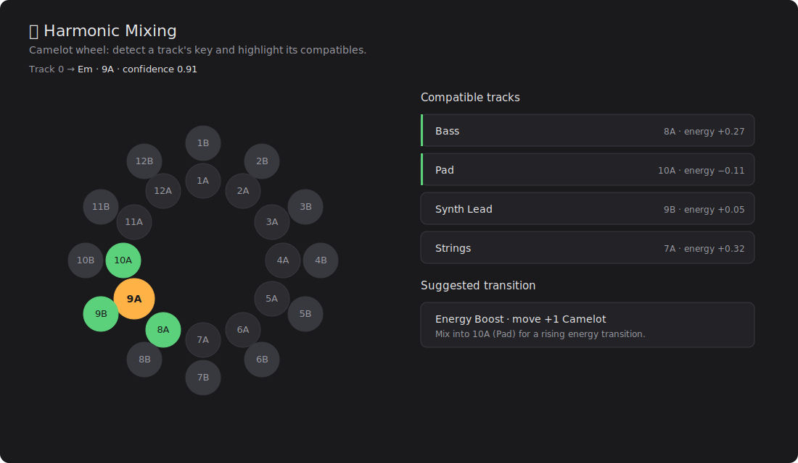

<p align="center">
  
</p>

<h1 align="center">🎛️ Live Studio</h1>

<p align="center">
  <b>A modular super-extension for Ableton Live.</b><br/>
  94 modules · 456 tools · 1293 quick actions · AI copilot · <code>⌘K</code> palette — all inside a single tabbed webview.
</p>

<p align="center">
  
  
  
  
  
  
  
  <a href="README.es.md"></a>
</p>

---

## What is it?

**Live Studio** combines dozens of music-production extensions for Ableton Live into **a single
extension**. Instead of installing and loading many extensions — each running its own server
fighting for the same port — Live Studio **assembles** them under:

- **a single local server + a single webview** with a side tab navigation,
- **lazy loading** of each panel (boots fast no matter how many modules it has),
- an **AI copilot** that drives any module via natural language,
- and a **quick command palette** (`⌘K` / `Ctrl+K`) that searches and executes everything.

It was born after auditing **921 in-house extensions** (≈74,700 LOC) and consolidating the best
of each concept into one place.

## ✨ Features

- **94 modules** (93 visible + 1 hidden) with **456 real tools** across categories: music
  generation, drums, mixing/mastering, EQ/analysis, synthesis, sampling, arrangement,
  performance/live, MIDI, hardware/control, project management, audio↔MIDI conversion and more.
- **AI copilot** (OpenRouter / OpenAI / OpenCode Zen) with a *tool-calling* loop: it receives
  the definitions of all 456 tools and orchestrates modules via natural language.
- **Quick command palette** (`⌘K`): indexes the **456 tools** + **1293 quick actions**
  (extracted from 215 micro-extensions) and runs them with the keyboard.
- **19 curated rich panels** where the auto-generated form falls short: piano-roll, Camelot
  wheel, graphs, automation curves, modulation matrix, mixer with faders/VU, step grids,
  pad grids, stereo meters, spectrogram…
- **Auto-generated UI** for everything else: any new module shows up with its form without
  writing HTML, reading its tool definitions.
- **Lightweight**: ~468 KB bundle, no frontend frameworks.
- **Tested**: 118 end-to-end smoke tests of the server + modules.

## 📸 Screenshots

<table>
  <tr>
    <td align="center" width="50%">
      <br/>
      <sub><b>Modules</b> — sidebar with namespaced tools and a panel with auto-generated forms per tool.</sub>
    </td>
    <td align="center" width="50%">
      <br/>
      <sub><b>AI Copilot</b> — chat that chains <code>create_midi_track</code> → <code>generate_chords</code> → <code>generate_pattern</code> in one instruction.</sub>
    </td>
  </tr>
  <tr>
    <td align="center">
      <br/>
      <sub><b>⌘K command palette</b> — mixes 456 real tools and 1293 quick actions in one search.</sub>
    </td>
    <td align="center">
      <br/>
      <sub><b>Mix Console</b> — channel strips with VU meters, vertical faders, pan and mute/solo.</sub>
    </td>
  </tr>
  <tr>
    <td align="center">
      <br/>
      <sub><b>Harmonic Mixing</b> — interactive Camelot wheel: detected key + compatible tracks highlighted.</sub>
    </td>
    <td align="center">
      <br/>
      <sub><b>Notation Viewer</b> — piano-roll of the clip's notes; color = velocity, height = pitch.</sub>
    </td>
  </tr>
</table>

## 🚀 Installation

### Option A — download the package
1. Download `live-studio.ablx` from the **[Releases](../../releases)** tab.
2. In Ableton Live: **Preferences → … → Install Extension** and pick the `.ablx`.
3. Open Live Studio from the extensions menu.

### Option B — build from source
```bash
git clone <repo-url> live-studio && cd live-studio
npm install
npm run build        # esbuild → dist/extension.js + copies the UI to dist/ui
npm run package      # produces live-studio.ablx (includes the UI)
npm run start        # extensions-cli run (inside Live's Extension Host)
```
Requirements: **Node ≥ 22.11** and the **Ableton Extensions SDK** (beta).

## 🤖 AI Copilot

In the **AI Copilot** tab pick a provider (OpenRouter / OpenAI / OpenCode Zen), paste your API
key and optionally a model. Example instructions:

> "create a MIDI track named Bass, generate a pop progression in C minor, then a techno beat at 124 BPM"

The key stays only in the local server's memory; nothing is persisted to disk.

## 🧩 Architecture

Every module exposes the same minimal contract, so they're **mergeable without adapters**:

```
ToolDefinition { name, description, category, parameters }
ToolResult     { success, data?, error? }
ToolRegistry   .register(def, handler)  .execute(name, args, song)
```

The `MasterRegistry` **absorbs** each child by delegating execution and *namespacing*
name/category (`drums__generate_pattern`). The shell exposes a uniform API:

| Method | Path | Purpose |
|---|---|---|
| GET | `/api/modules` | modules for the sidebar |
| GET | `/api/tools[?module=id]` | tool definitions |
| POST | `/api/execute` | `{name, args}` → execute a tool |
| POST | `/api/chat` | AI copilot (tool-calling loop) |
| GET/POST | `/api/config` | provider / API key / model |

```
src/
├── extension.ts          # activate(): registry → bridge → server → showModalDialog
├── server.ts             # unified endpoints, dynamic port, serves the UI
├── bridge.ts             # executeTool() + processChat() (AI loop)
├── core/{registry,llm}.ts
├── registry/index.ts     # ← assembly point (add a module = 1 line)
└── modules/<id>/tools.ts # each module = its own toolRegistry
public/
├── index.html · shell.js · styles.css   # shell + autoform + palette
└── panels/<id>.js                        # 19 rich panels
```

### Adding a module (3 steps)
1. Copy the `toolRegistry` into `src/modules/<id>/tools.ts` (exporting `createToolRegistry()`).
2. Register it in `src/registry/index.ts`:
   ```ts
   m.addModule({ id:"reverb", label:"Reverb & Delay", icon:"🌫️", registry: reverbTools() });
   ```
3. `npm run build`. It shows up in the UI and is available to the copilot. **No HTML needed.**

### Rich panels
Create `public/panels/<id>.js` that registers `window.LiveStudioPanels["<id>"] = (panel, helpers) => …`
and add it to `index.html`. `shell.js` uses it instead of the autoform. There are 19 already:
`organizer`, `fxchain`, `mixconsole`, `stepseq`, `spectrogram`, `chordpads`, `drums`, `modmatrix`,
`drummap`, `harmonic` (Camelot wheel), `clipgraph` (graph), `midimon`, `eq`, `automation` (curve),
`notation` (piano-roll), `genre`, `sidechain`, `stereo`, `takes`.

## 🛠️ Development

```bash
npm run build       # compile (esbuild)
npm run typecheck   # tsc --noEmit
npm run test        # 118 smoke tests (server + modules, simulated song)
npm run package     # build + package .ablx with the UI
```

## 📚 Module catalog

<details>
<summary><b>Show all 94 modules by batch</b></summary>

- **Batch 1 (core):** Session & Tracks · Chords & Progressions · Drums & Patterns · EQ & Analysis
- **Batch 2 (mixing/sound):** Sidechain · Stereo & Imaging · Sampler & Slicing · Arrangement & Navigation · Vocal Chain & FX · SFX & Textures
- **Batch 3 (perf/comp/org):** Melody Generator · Performance & Looper · Clips & Scenes · DJ & Harmonic Mixing · Takes & Comping · Clip Colorizer
- **Batch 4:** Gain Staging & Levels · Synth Patchbay · Project Templates · Project Notes · Groove & Humanize · Automation & Curves
- **Star (rich panels):** Session Organizer · FX Chains
- **Batch 6:** Compression & Dynamics · AI Mixing Assistant · Genre Classifier · EQ Match · MIDI Harmonizer · Quantize & Swing · Delay Calculator · MIDI Randomizer · Stem Splitter · Arrangement Sections
- **Batch 7:** Lyric → Melody · FX Chain Presets · Plugin Browser · Time Signature · Crossfade Tool · Device Presets · Microtonal Tuner · Chord Pads · Snapshots · Project Health
- **Batch 8:** Controller Mapper · Notation Viewer · Drum Replacer · Audio → MIDI · Generative Arranger · Setlist Manager · Media Pool · Group Routing · Bulk Track Manager · Tempo & Grid Sync
- **Batch 9:** Mix Scene Saver · API Console · File Manager · Clip Versions · Looper Controller · Drum Map Editor · MIDI Gate · Audio Restorer · Macro Mapper Pro · Step Sequencer
- **Batch 10:** Drum Bus Processor · Rack Preset Cycler · Vocal Comp Editor · Max Device Manager · Recording Router · Cue / Headphone Mixer · Arrangement Looper · Modulation Matrix · Phase Aligner · Spectrogram
- **Batch 11:** Mix Console View · Track Color Coordinator · Export Batch Processor · Rack Builder · Audio Comparer A/B · Vocal Tuner · MIDI Transformer · Sidechain Designer Pro · MIDI LFO · Frequency Splitter
- **Batch 12:** Clip Launch Quantizer · Live Coding Sandbox · Audio Fingerprint ID · Clip Relation Graph · Tempo Tapper · Patch Browser · MIDI Map Visualizer · Cue Mixer · Audio Quantizer · MIDI Monitor

</details>

## 🙏 Credits

Built on top of the **Ableton Extensions SDK**. Assembled from in-house extensions,
consolidating the best of each concept into a single super-app.

## 📄 License

[MIT](LICENSE) © 2026 Ramón Sesma
