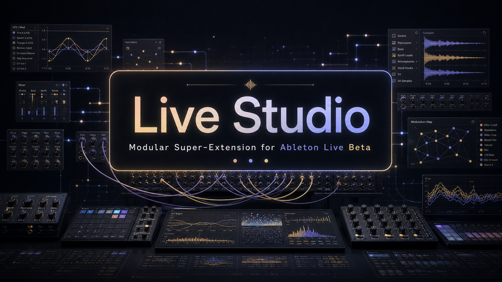
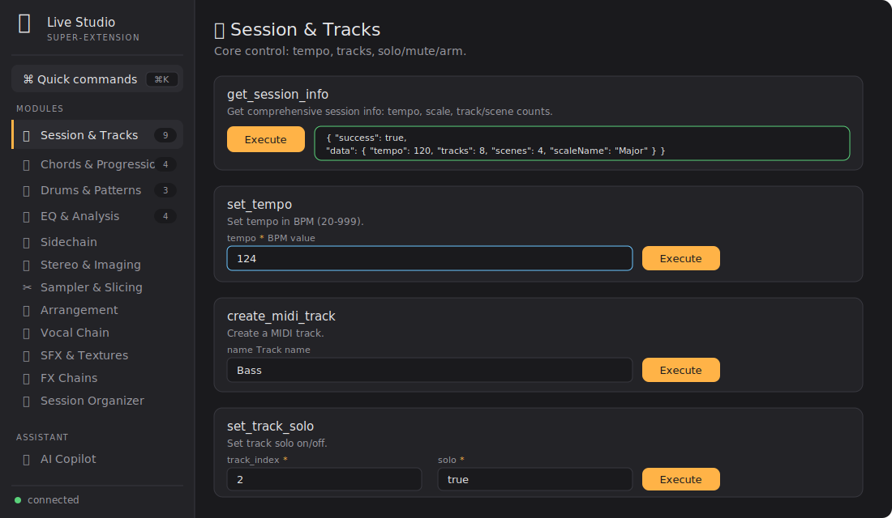
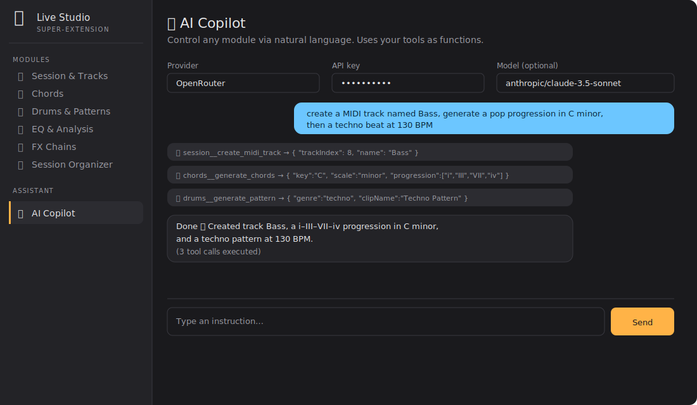
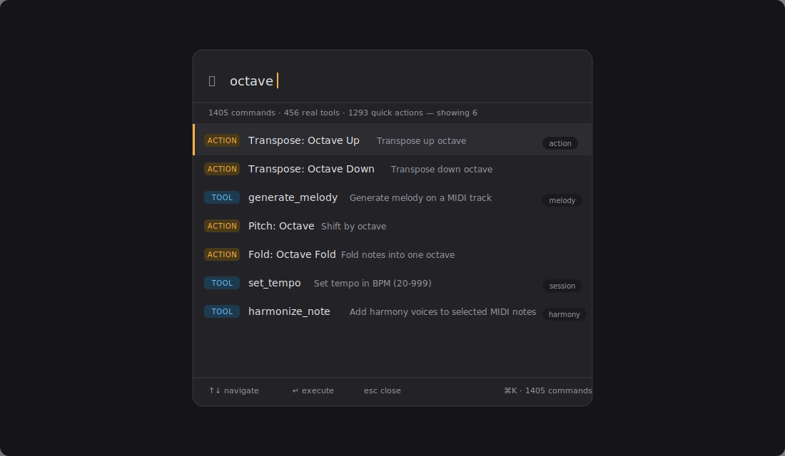
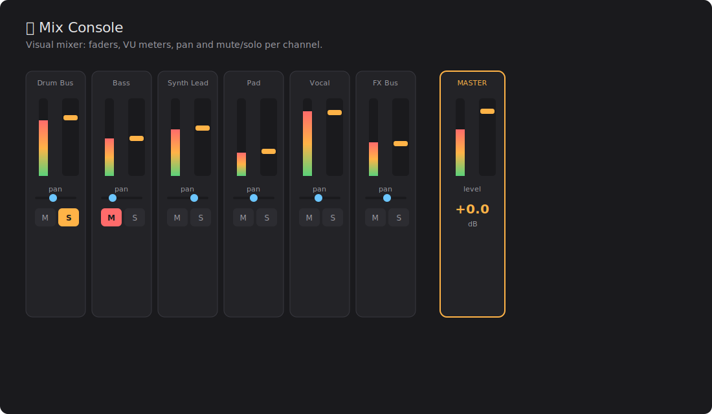
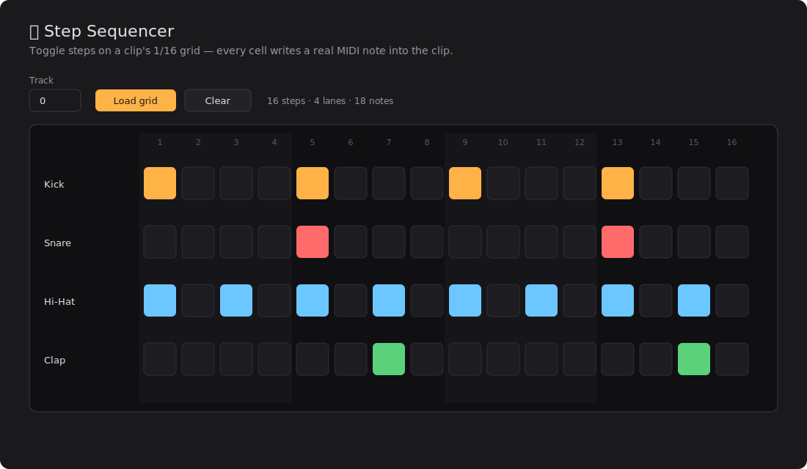
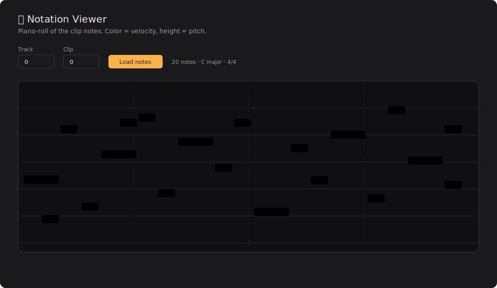
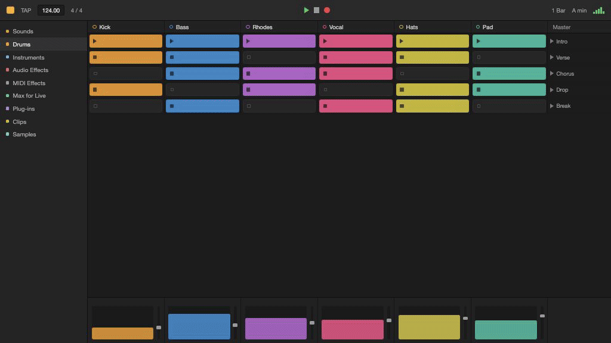

<p align="center">
  
</p>

<h1 align="center">🎛️ Live Studio</h1>

<p align="center">
  <b>A modular super-extension for Ableton Live.</b><br/>
  132 modules · 382 tools · 83 quick actions · AI copilot · <code>⌘K</code> palette — all inside a single tabbed webview.
</p>

<p align="center">
  <a href="https://github.com/ramonsesma/live-studio/actions/workflows/ci.yml"></a>
  
  
  
  
  
  
  
  <a href="README.es.md"></a>
</p>

---

## What is it?

**Live Studio** combines dozens of music-production extensions for Ableton Live into **a single
extension**. Instead of installing and loading many extensions — each running its own server
fighting for the same port — Live Studio **assembles** them under:

- **a single local server + a single webview** with a side tab navigation,
- **lazy loading** of each panel (boots fast no matter how many modules it has),
- an **AI copilot** that drives any module via natural language,
- and a **quick command palette** (`⌘K` / `Ctrl+K`) that searches and executes everything.

It was born after auditing **921 in-house extensions** (≈74,700 LOC) and consolidating the best
of each concept into one place.

## ✨ Features

- **132 modules** (all visible) with **382 real tools** across categories: music
  generation, drums, mixing/mastering, EQ/analysis, synthesis, sampling, arrangement,
  performance/live, MIDI, hardware/control, project management, audio↔MIDI conversion and more.
- **AI copilot** (OpenRouter / OpenAI / Gemini / NVIDIA NIM / OpenCode Zen) with a *tool-calling* loop: it discovers and
  runs **any of the 382 tools** through a meta-toolkit (`find_tools` searches the whole suite,
  `list_modules` browses, `run_tool` executes) — reaching everything without flooding the model.
- **Quick command palette** (`⌘K`): indexes the **382 tools** + **83 quick actions**
  (each one a shortcut that runs a real tool with preset args) and runs them with the keyboard.
- **115 curated rich panels** where the auto-generated form falls short: piano-roll, clip
  graph, mixer with faders/pan/sends, step grids, pad grids, drum map, comping, EQ curve, LFO designer,
  trance gate, synth patchbay, arrangement timeline, track grid, gain staging, rack builder,
  session health, performance pad, version diff…
- **Dashboard + live updates**: a home view with the project at a glance (BPM, key, tracks,
  clips, scenes, snapshots) that refreshes live — the server diffs the Set every 1.5s and pushes
  SSE events; panels like the Mix Console re-render themselves when the Set changes.
- **Favorites, recents & work profiles**: pin modules, jump back to recent ones, and filter the
  sidebar by profile (Mixing / Sound design / Performance) — persisted server-side.
- **Copilot plan mode**: "Plan first" makes the AI propose a reviewable step-by-step plan
  (read-only exploration, zero execution) that you apply with one click — every step undoable
  via Edit History.
- **Self-documenting**: `npm run gen:catalog` regenerates a static, searchable catalog of all
  modules/tools (docs/) straight from the registry; `npm run new:module` scaffolds a complete
  module (tools + panel + registration + tests) in one command.
- **Bilingual UI (EN/ES)**: the shell auto-detects the system language (with a manual toggle) —
  one shared codebase, no duplicated files, via a single string dictionary (`public/i18n.js`).
  All 382 tool descriptions are translated too (`public/desc-i18n.js`), shown in the autoform,
  the command palette and panel headers — the English text the AI copilot reads stays untouched.
- **Lazy panel loading**: rich panels (~670 KB total) load on first visit to their module instead
  of all 115 upfront, so the UI shows up instantly.
- **Auto-generated UI** for everything else: any new module shows up with its form without
  writing HTML, reading its tool definitions.
- **Lightweight**: ~840 KB bundle, no frontend frameworks.
- **Tested**: 292 end-to-end smoke tests of the server + modules.

## 📸 Screenshots

<table>
  <tr>
    <td align="center" width="50%">
      <br/>
      <sub><b>Modules</b> — sidebar with namespaced tools and a panel with auto-generated forms per tool.</sub>
    </td>
    <td align="center" width="50%">
      <br/>
      <sub><b>AI Copilot</b> — chat that chains <code>create_midi_track</code> → <code>generate_chords</code> → <code>generate_pattern</code> in one instruction.</sub>
    </td>
  </tr>
  <tr>
    <td align="center">
      <br/>
      <sub><b>⌘K command palette</b> — mixes 382 real tools and 83 quick actions in one search.</sub>
    </td>
    <td align="center">
      <br/>
      <sub><b>Mix Console</b> — channel strips with vertical faders, pan, sends and mute/solo (no VU — the SDK exposes no live metering).</sub>
    </td>
  </tr>
  <tr>
    <td align="center">
      <br/>
      <sub><b>Step Sequencer</b> — toggle steps on a clip's 1/16 grid; each cell writes a real MIDI note.</sub>
    </td>
    <td align="center">
      <br/>
      <sub><b>Notation Viewer</b> — piano-roll of the clip's notes; color = velocity, height = pitch.</sub>
    </td>
  </tr>
</table>

---

## ⭐ Featured — Resonance · Mix Radar

<p align="center">
  
</p>

**The first Live extension that renders your set to audio, _listens_, and produces back into it.** Single-channel plugins only ever see one track — Resonance sees the **whole set**.

- **Listen** — renders each audio stem with `resources.renderPreFxAudio`, then runs a real **FFT inside the extension host** (zero native deps): 30 log bands, dominant frequency and loudness per track.
- **See the masking** — fuses the per-track spectra into a **frequency × track collision matrix**; where two tracks fight in the same band, the cell turns red.
- **Act** — turns each collision into a one-click corrective **move** (carve EQ, trim, pan) written back via `DeviceParameter.setValue`, all collapsed into a single undo (`withinTransaction`).
- **Remember** — caches spectral fingerprints per project in `environment.storageDirectory`.

The Mix Radar is the most elaborate of the 115.

---

## 🚀 Installation

> **You do not need the SDK, Node, or any coding to *use* this.** Just the `.ablx` file
> below and Ableton Live 12.4.5b+.

### Option A — download and install (for everyone)
1. Download **`live-studio.ablx`** from the **[Releases](../../releases)** tab.
2. In Ableton Live open **Preferences → Extensions** and **drag the `.ablx` onto that
   panel** (or use its install button). Live confirms it's installed.
3. **Make sure “Developer Mode” is OFF** in that same Extensions tab. Developer Mode hands
   the extension host to the SDK runner, so an *installed* `.ablx` won't start while it's on.
4. **Quit and reopen Ableton Live** (a full restart — this is needed for the extension's
   host process to start in the current beta).
5. Open the UI: **right-click a track, an empty clip slot, a clip or a scene → Extensions →
   Live Studio.** The window opens; close it with the window's ✕.

> Troubleshooting: if "Live Studio" isn't in the right-click **Extensions** submenu, it's
> almost always (a) Developer Mode left ON, or (b) Live wasn't fully restarted after install
> — both are known Live 12 Beta quirks. Re-check those two and relaunch Live.

### Option B — build from source (for developers)
```bash
git clone <repo-url> live-studio && cd live-studio
npm install
npm run build        # esbuild → dist/extension.js + copies the UI to dist/ui
npm run package      # produces live-studio.ablx (includes the UI)
npm run start        # extensions-cli run (inside Live's Extension Host)
```
Requirements: **Node ≥ 22.11** and the **Ableton Extensions SDK** (beta).

## 🤖 AI Copilot

In the **AI Copilot** tab pick a provider (OpenRouter / OpenAI / Gemini / NVIDIA NIM / OpenCode Zen), paste your API
key and optionally a model. Example instructions:

> "create a MIDI track named Bass, generate a pop progression in C minor, then a techno beat at 124 BPM"

The key stays only in the local server's memory; nothing is persisted to disk.

## 🧩 Architecture

Every module exposes the same minimal contract, so they're **mergeable without adapters**:

```
ToolDefinition { name, description, category, parameters }
ToolResult     { success, data?, error? }
ToolRegistry   .register(def, handler)  .execute(name, args, song)
```

The `MasterRegistry` **absorbs** each child by delegating execution and *namespacing*
name/category (`drums__generate_pattern`). The shell exposes a uniform API:

| Method | Path | Purpose |
|---|---|---|
| GET | `/api/modules` | modules for the sidebar |
| GET | `/api/tools[?module=id]` | tool definitions |
| POST | `/api/execute` | `{name, args}` → execute a tool |
| POST | `/api/chat` | AI copilot (tool-calling loop) |
| GET/POST | `/api/config` | provider / API key / model |

```
src/
├── extension.ts          # activate(): registry → bridge → server → showModalDialog
├── server.ts             # unified endpoints, dynamic port, serves the UI
├── bridge.ts             # executeTool() + processChat() (AI loop)
├── core/{registry,llm}.ts
├── registry/index.ts     # ← assembly point (add a module = 1 line)
└── modules/<id>/tools.ts # each module = its own toolRegistry
public/
├── index.html · shell.js · styles.css   # shell + autoform + palette
└── panels/<id>.js                        # 115 rich panels
```

### Adding a module (3 steps)
1. Copy the `toolRegistry` into `src/modules/<id>/tools.ts` (exporting `createToolRegistry()`).
2. Register it in `src/registry/index.ts`:
   ```ts
   m.addModule({ id:"reverb", label:"Reverb & Delay", icon:"🌫️", registry: reverbTools() });
   ```
3. `npm run build`. It shows up in the UI and is available to the copilot. **No HTML needed.**

### Rich panels
Create `public/panels/<id>.js` that registers `window.LiveStudioPanels["<id>"] = (panel, helpers) => …`.
No `index.html` edit needed — panels load lazily: `shell.js` fetches `/panels/<id>.js` the first
time a module is opened (a 404 just falls back to the autoform), so nothing is downloaded until
it's actually used. There are 115 already, including:
`organizer`, `fxchain`, `mixconsole`, `stepseq`, `chordpads`, `drums`, `drummap`, `clipgraph` (graph), `notation` (piano-roll), `takes`, `eq` (EQ curve), `midilfo` (LFO designer), `midigate` (trance gate), `synth` (patchbay), `genarranger` (arrangement timeline), `trackmanager` (track grid), `health` (session health), `mastering` (gain staging), `rackbuilder` (rack), `performance` (performance pad), `clipversions` (versions & snapshots), `resonance` (mix radar + masking matrix), `autogain` (auto gain-staging), `keyscale` (key detection), `genrhythm` (generative rhythm), `texturemap` (audio→MIDI), `spectrumcompare` (spectrum match), `projectsnapshot` (git for Live Sets), `scoreeditor` (notation + MusicXML), `clipvariations` (variation engine), `stemalign` (stem aligner), `samplebrain` (sample library brain), `macromorph` (macro snapshot morph), `loopdetect` (loop BPM), `warpcompare` (warp A/B), `paramdiff` (outlier QA), `phrasefinder` (MIDI phrase search), `saferandom` (safe randomizer), `groovetemplate` (groove extractor), `probabilitylab` (probability lab), `devremote` (remote-control any device, incl. Max for Live), `stemexport` (batch stem export), `mixcoach` (prioritized mix next-steps), `history` (undo/redo timeline), `templates` (genre starter kits), `mixscene` (mixer A/B recall), `tempotap` (tap tempo), `notes` (sticky notes), `sandbox` (live-coding REPL), `delaycalc` (delay time table), `setlist` (reorderable setlist), `fxpresets` (saved FX chains), `groove` (groove extractor/humanizer), `colorizer` (clip coloring by metric), `vocal` (vocal chain builder).

## 🛠️ Development

```bash
npm run build         # compile (esbuild)
npm run typecheck     # tsc --noEmit
npm run test          # 292 smoke tests (server + modules, simulated song)
npm run package       # build + package .ablx with the UI
npm run new:module     # scaffold a module: tools.ts + rich panel + registry + smoke-test entries, one command
npm run gen:catalog    # regenerate docs/catalog.html — a static, searchable catalog of every module/tool
```

For developers, `npm run new:module -- <id> "<Label>" [icon] ["description"]` creates
`src/modules/<id>/tools.ts` (one example tool, real `song` state), `public/panels/<id>.js` (a
rich panel with live refresh wired in), registers the module in `src/registry/index.ts`, and
extends `test/smoke.ts` so the suite immediately covers it — no manual edits, no forgetting a step.

> **Packaging notes — avoiding `No manifest.json found` at install time.**
> Live's installer unzips the `.ablx` and then validates `manifest.json`; if either the
> archive can't be read or the manifest fails validation, it surfaces the same generic
> `No manifest.json found` error. Two things matter:
>
> 1. **`version` must be a strict `MAJOR.MINOR.PATCH`** (e.g. `1.0.0`). Live's manifest
>    validator rejects pre-release suffixes like `1.0.0-beta.0`, and the install then
>    reports `No manifest.json found` even though the file is present. All of the SDK's
>    own example manifests use plain `1.0.0`.
> 2. **Build the entry as CommonJS** (`format: "cjs"` in `build.ts`). The `.ablx` ships
>    no `package.json`, so the Extension Host loads `dist/extension.js` as CJS; an ESM
>    bundle fails at load time with `Cannot use import statement outside a module` (the
>    extension installs but never shows up). The SDK's auto-generated build uses cjs.
> 3. **Package with Info-ZIP (`zip -X`)**, which `npm run package` does instead of the
>    default `extensions-cli package`. The default relies on `archiver`, which writes
>    entries in *streaming mode* with data descriptors (`size=0`/`crc=0` in the local
>    headers); `zip -X` writes standard local headers with real sizes, which Live's
>    archive reader (minizip) handles reliably.

## 📚 Module catalog

<details>
<summary><b>Show the 132 modules by category</b> (all visible — none are hidden)</summary>

- **Session & project:** Session & Tracks · Clips & Scenes · Bulk Track Manager · Track Color Coordinator · Project Templates · Project Notes · Project Health · Session Organizer · **Project Snapshot · Git** · Sample Library Brain · Param Diff & Outlier · MIDI Phrase Finder · Stem Export
- **MIDI & composition:** Chords & Progressions · Melody Generator · Lyric → Melody · MIDI Harmonizer · MIDI Randomizer · MIDI Transformer · MIDI Gate · MIDI LFO · Chord Pads · Step Sequencer · Quantize & Swing · Groove & Humanize · Notation Viewer · Generative Rhythm · Score Editor · Clip Variation Engine · Groove Template Extractor · Probability Lab
- **Drums:** Drums & Patterns · Drum Replacer · Drum Map Editor · Drum Bus Processor
- **Mixing & FX:** EQ & Analysis · Compression & Dynamics · Gain Staging & Levels · AI Mixing Assistant · Mix Console View · Mix Scene Saver · FX Chains · FX Chain Presets · Macro Mapper Pro · Rack Builder · Macro Snapshot Morph · Safe Randomizer · **Resonance · Mix Radar** ⭐ · Auto-Gain Stager · Key & Scale Detective · Spectrum Match · Device Remote · Mix Coach
- **Arrangement & performance:** Arrangement & Navigation · Arrangement Sections · Generative Arranger · Performance & Looper · Takes & Comping · Clip Colorizer · Clip Versions · Clip Relation Graph · Clip Launch Quantizer · Setlist Manager
- **Tempo & time:** Tempo & Grid Sync · Tempo Tapper · Time Signature · Delay Calculator · Loop Length Detective
- **Sound design:** Synth Patchbay · SFX & Textures · Vocal Chain & FX · Audio Texture Mapper · Stem Aligner · Warp Mode A/B Comparator
- **Routing & dev:** Group Routing · API Console · Live Coding Sandbox · Edit History (undo/redo timeline) · Quick Actions (⌘K palette, 83 actions)

> Modules that depended on capabilities the Live Extensions SDK doesn't expose (audio
> DSP/analysis, transport/recording, hardware/controllers, file/library access, plugin
> scanning) were removed so every module here operates on the real Set.

</details>

## 🙏 Credits

Built on top of the **Ableton Extensions SDK**. Assembled from in-house extensions,
consolidating the best of each concept into a single super-app.

## 📄 License

[GNU GPL v3](LICENSE) © 2026 Ramón Sesma.

Free software with strong copyleft: you may use, study, modify and share it — but any
distributed version (including modified or commercial ones) must stay open under the GPL;
it cannot be turned into a closed, proprietary product.
